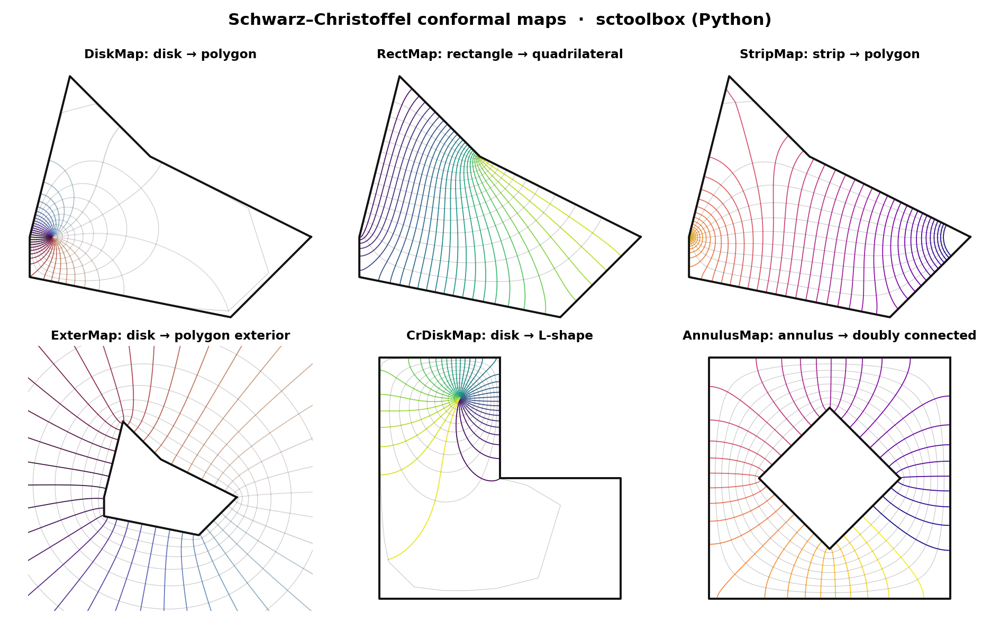
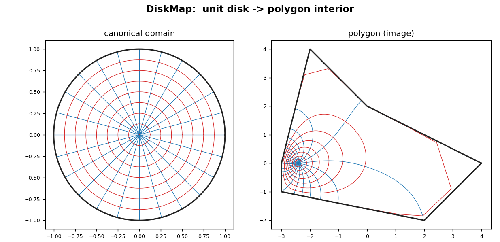
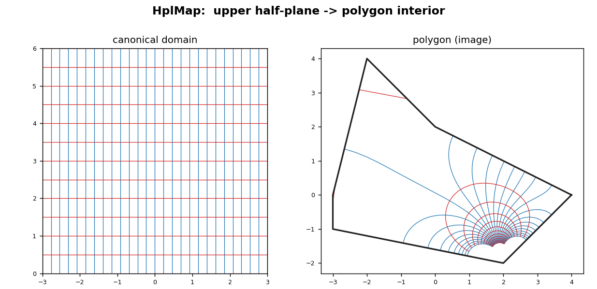
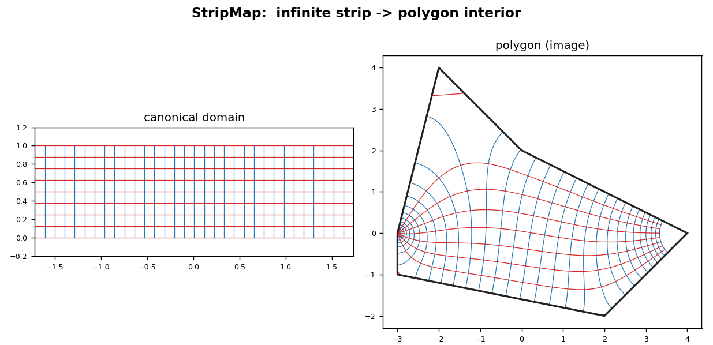
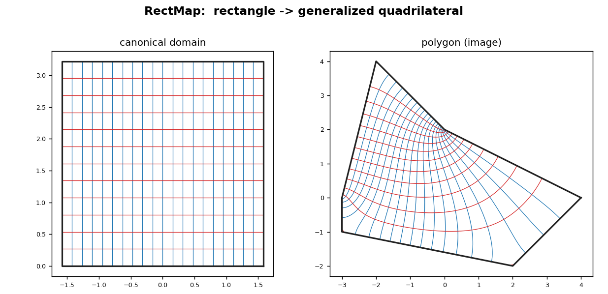
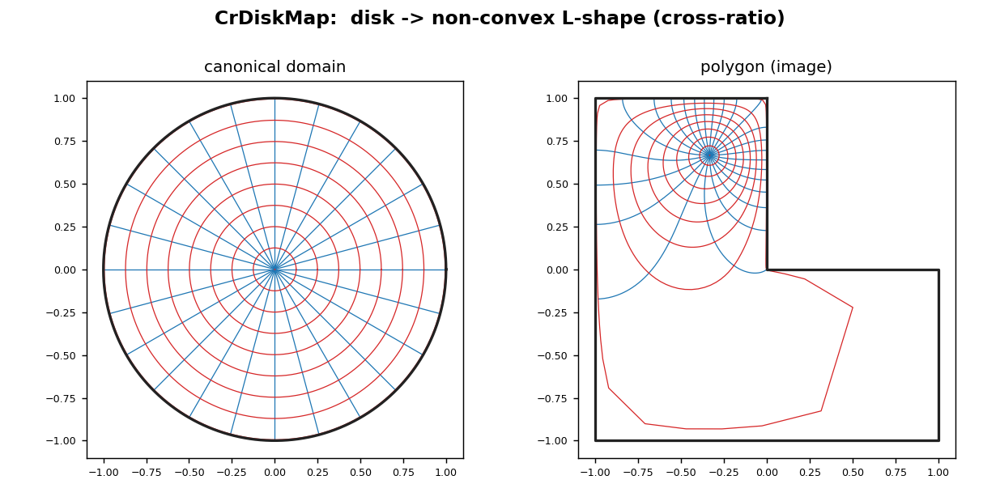
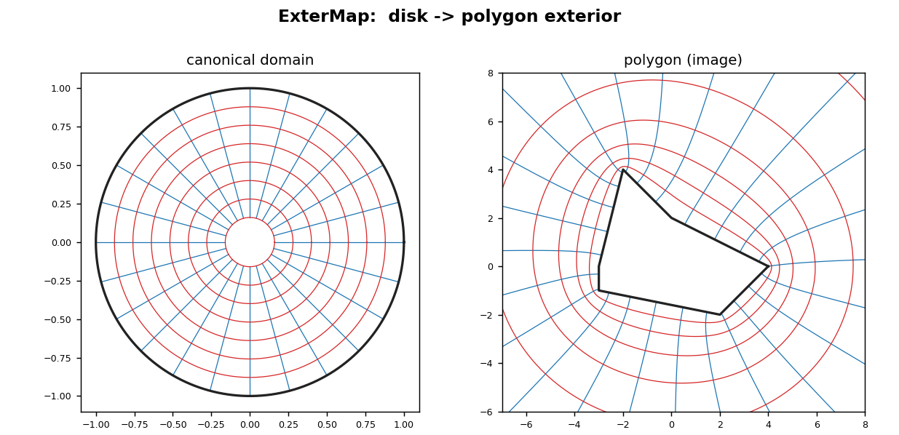
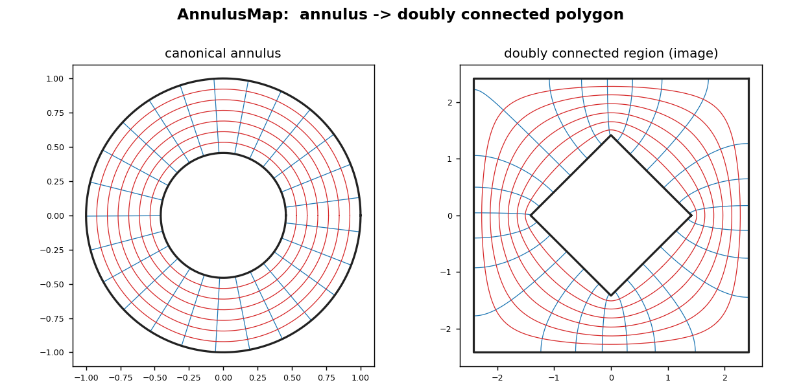

# SC Toolbox — Python bindings

Python bindings for the C++ port of the Schwarz–Christoffel Toolbox, built with
[nanobind](https://github.com/wjakob/nanobind). They expose the seven
Schwarz–Christoffel conformal map classes plus the doubly connected annulus map,
with NumPy-native input and output.

Schwarz–Christoffel maps are conformal (angle-preserving) maps between a simple
*canonical* domain — the unit disk, upper half-plane, infinite strip, or a
rectangle — and an arbitrary polygon. They are the workhorse of 2-D potential
theory, meshing, and complex-analysis applications.

## Map types

| Class | Canonical domain | Target |
|---|---|---|
| `DiskMap` | unit disk | polygon interior |
| `HplMap` | upper half-plane | polygon interior |
| `ExterMap` | unit disk | polygon exterior |
| `StripMap` | infinite strip | polygon interior |
| `RectMap` | rectangle | generalized quadrilateral |
| `CrDiskMap` | unit disk (cross-ratio) | polygon interior |
| `AnnulusMap` | annulus | doubly connected region |

## Install

Requires a C++17 compiler and CMake. Eigen is fetched automatically at build
time if it is not already installed.

```sh
cd python
pip install .
```

For the examples/plots you also need matplotlib:

```sh
pip install ".[examples]"
```

## Quick start

```python
import numpy as np
from sctoolbox import Polygon, DiskMap

# An L-shaped polygon (vertices counterclockwise).
verts = np.array([1j, -1 + 1j, -1 - 1j, 1 - 1j, 1, 0], dtype=complex)
m = DiskMap(Polygon(verts))

# Map a circle of disk points into the polygon.
z = 0.6 * np.exp(1j * np.linspace(0, 2 * np.pi, 200))
w = m.eval(z)

# Invert, and check the round trip.
z_back = m.evalinv(w)
print(np.max(np.abs(z_back - z)))     # ~1e-14

print(m.accuracy())                   # estimated map accuracy
print(m.prevertex)                    # solved prevertices on the unit circle
```

Every interior/exterior map exposes the same surface:

- `eval(zp)` — forward map (canonical → polygon), NaN outside the domain
- `evalinv(wp)` — inverse map (polygon → canonical)
- `evaldiff(zp)` — derivative of the forward map
- `accuracy()` — estimated accuracy of the solved map
- `polygon`, `prevertex`, `constant`, `qdata` — solved parameters

`StripMap` additionally takes the two 1-indexed `ends` vertices, `RectMap` takes
the four 1-indexed `corners`, and `AnnulusMap` is constructed from an outer and
an inner `Polygon` and operates on scalar complex points.

## Gallery

A single montage of every map type (grid lines colored by a cyclic colormap):



The per-map figures below draw an orthogonal grid in the canonical domain (left)
and its conformal image inside the target polygon (right). Because the maps are
conformal, the two grid-line families stay orthogonal after mapping. Regenerate
everything with `python examples/render_examples.py`.

### DiskMap — unit disk → polygon interior


### HplMap — upper half-plane → polygon interior


### StripMap — infinite strip → polygon interior


### RectMap — rectangle → generalized quadrilateral


### CrDiskMap — disk → elongated polygon (cross-ratio formulation)


### ExterMap — disk → polygon exterior


### AnnulusMap — annulus → doubly connected polygon


## Tests

```sh
pip install ".[test]"
pytest tests
```

The Python tests check forward/inverse round trips, that prevertices map to
polygon vertices, derivative consistency against finite differences, and the
estimated accuracy, for every map type.

## How it is built

`python/CMakeLists.txt` reuses the `sctoolbox` C++ library target from `../cpp`
(with its Catch2 test target switched off) and links it into a single nanobind
extension module, `sctoolbox._sctoolbox`. Eigen ↔ NumPy conversion is handled by
`nanobind/eigen/dense.h`, so all array arguments and results are plain NumPy
complex arrays. The build is driven by
[scikit-build-core](https://github.com/scikit-build/scikit-build-core).
